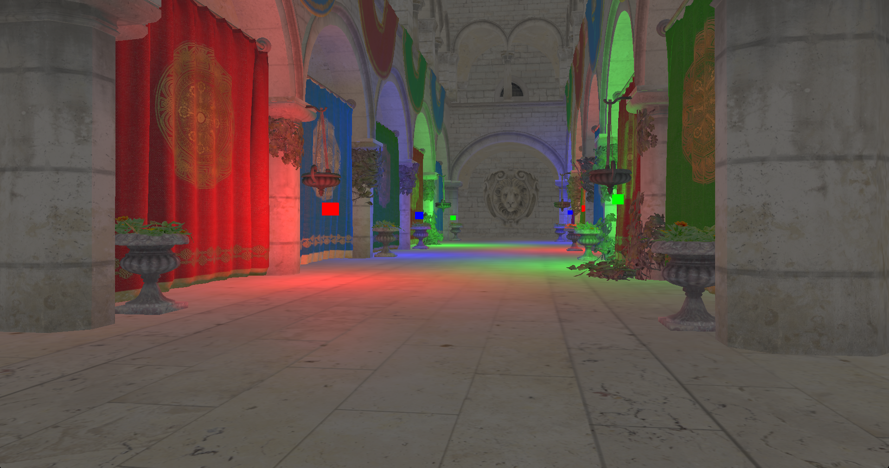
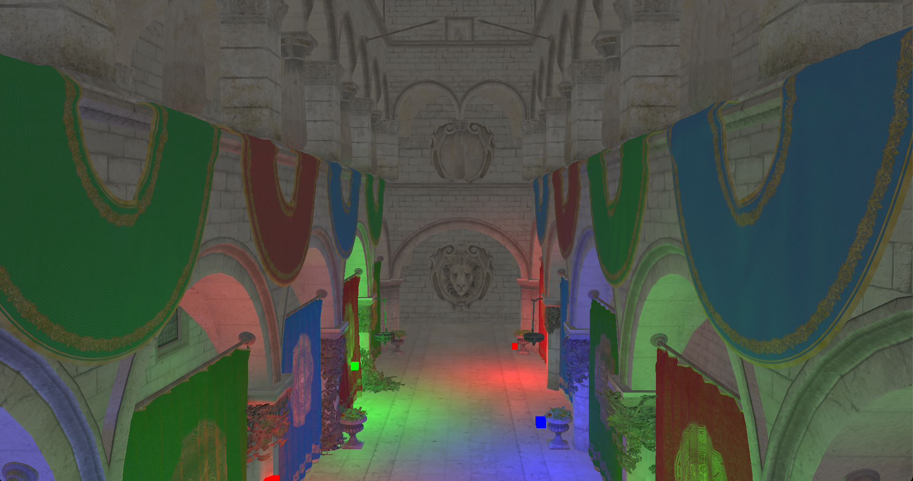

# OpenGL Renderer

A C++20 OpenGL renderer focused on model loading and real-time lighting. The demo renders Sponza with six red, green, and blue point lights and matching light cubes scattered throughout the courtyard.

The renderer uses an FPS-style camera to navigate the scene. Use **WASD** to move, the **mouse** to look around, **Space** to ascend, **Left Shift** to descend, the **scroll wheel** to change the field of view, and **Esc** to exit.

## Screenshots





## Current features

- OBJ model and material loading via `tinyobjloader`.
- Phong shading with diffuse and specular textures.
- Multiple lights, with support for point, directional, and spot lights.
- Normal map loading and tangent-space setup (normal mapping is currently disabled in the fragment shader).
- Free-fly camera with mouse look.

## Building

### Prerequisites

- A C++20-capable compiler and a CMake-compatible build tool, such as Make, Ninja, or Visual Studio.
- CMake 3.20 or newer.
- Git and internet access for downloading dependencies during configuration.
- An OpenGL 4.1-capable graphics driver; the shaders use GLSL 4.10.

On macOS, install the Xcode Command Line Tools with `xcode-select --install`. On Windows, use a Visual Studio developer terminal with the C++ build tools installed. On Linux, install the OpenGL development libraries and the [GLFW development dependencies for X11 and Wayland](https://www.glfw.org/docs/3.4/compile.html#compile_deps).

CMake downloads GLFW, GLM, and stb through FetchContent. GLAD and tinyobjloader are included in the repository, along with the demo models and textures.

### Configure and compile

```sh
git clone https://github.com/hanson777/opengl-renderer.git
cd opengl-renderer

cmake -S . -B build -DCMAKE_BUILD_TYPE=Release
cmake --build build --config Release --target opengl-renderer --parallel 4
```

The first configuration downloads dependencies. Subsequent builds reuse the files in `build/`.

### Run

Run from the repository root so the renderer can find `res/` and `shaders/`:

```sh
./build/opengl-renderer
```

For a Visual Studio build on Windows:

```powershell
.\build\Release\opengl-renderer.exe
```
